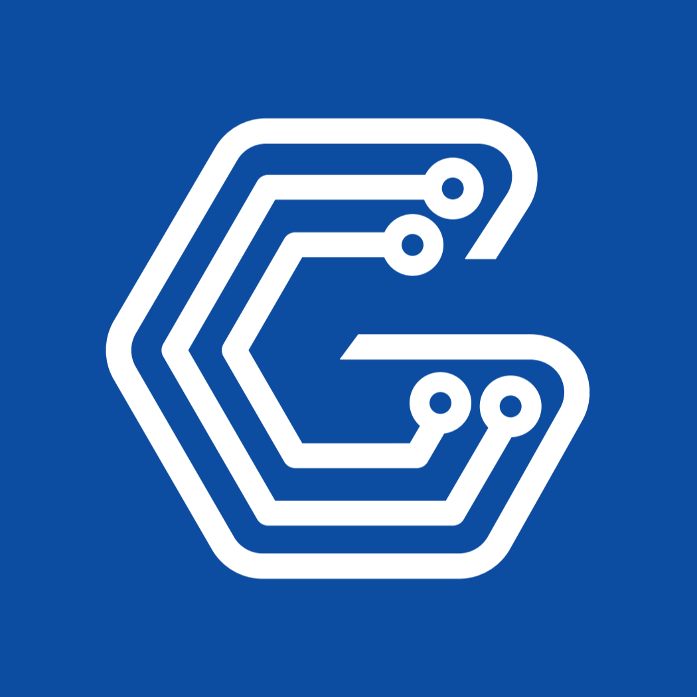

<p align="center">
  
</p>

<h1 align="center">Going Library</h1>

<p align="center">
  .NET 8.0 기반 산업용 HMI/SCADA UI 프레임워크
</p>

<p align="center">
  <a href="https://www.nuget.org/packages/Going.Basis"></a>
  <a href="https://www.nuget.org/packages/Going.UI"></a>
  <a href="https://www.nuget.org/packages/Going.UI.OpenTK"></a>
  <a href="https://www.nuget.org/packages/Going.UI.Forms"></a>
</p>

---

## 개요

**Going Library**는 C# .NET 8.0 기반의 산업용 HMI/SCADA UI 프레임워크입니다. SkiaSharp 커스텀 렌더링으로 구현되어 임베디드 터치 패널에 최적화된 산업용 컨트롤과 통신 스택을 제공합니다.

### 주요 특징

- **산업용 컨트롤** — GoButton, GoLamp, GoDataGrid, GoSlider, GoGauge, GoMeter, 그래프(Line/Bar/Circle/Time/Trend/Sparkline), 벡터 셰이프(GsShape), 배관 흐름(FlowSystem) 등
- **선언적 UI(.gudx)** — XML 마크업으로 화면을 정의하고 런타임에 로드. `{path}` 식으로 데이터 객체에 단/양방향 바인딩, 재사용 컴포넌트(`<GoComponent>`), 컬렉션 반복(`GoItemList`)
- **산업용 통신** — Modbus RTU/TCP, MQTT, LS Electric CNet, Mitsubishi MC
- **크로스 플랫폼** — Raspberry Pi(linux-arm64), Windows, Linux
- **테마** — 다크 테마 기본 제공, 색상 토큰(Base0~5/Fore/Back/Good/Warning/Danger 등) 커스터마이징

---

## 패키지

| 패키지 | 설명 | 대상 |
|--------|------|------|
| **Going.UI** | 플랫폼 독립 UI 코어 (컨트롤, 컨테이너, 테마, 디자인, .gudx, 바인딩) | `net8.0` |
| **Going.UI.OpenTK** | OpenTK 어댑터 (임베디드/Raspberry Pi/데스크톱) | `net8.0` |
| **Going.UI.Forms** | WinForms 어댑터 (Windows 데스크톱) | `net8.0-windows` |
| **Going.Basis** | 통신 및 유틸리티 (Modbus, MQTT, CNet, MC) | `net8.0` |

```bash
dotnet add package Going.UI.OpenTK
dotnet add package Going.Basis
```

## 빠른 시작

화면은 `.gudx` 마크업으로, 데이터 연결은 바인딩 식으로 처리합니다. 코드 생성 도구 없이 라이브러리만으로 동작합니다.

**ui/Main.gudx**

```xml
<GoDesign>
  <Pages>
    <GoPage Name="Main" BackColor="Back">
      <Childrens>
        <GoLabel  Text="{Status}"      Bounds="12,10,348,44" FontSize="20" TextColor="Point"/>
        <GoLabel  Text="{Motor.Rpm:F0}" Bounds="12,52,348,96" FontSize="26"/>
        <GoButton Text="START"         Bounds="12,110,348,160" Name="btnStart"/>
      </Childrens>
    </GoPage>
  </Pages>
</GoDesign>
```

> `Bounds`는 `Left,Top,Right,Bottom` 입니다.

**Program.cs**

```csharp
using System.Xml.Linq;
using Going.UI.Design;
using Going.UI.Gudx;
using Going.UI.OpenTK.Windows;
using OpenTK.Windowing.Common;

var hub = new AppHub();
var design = GoGudxConverter.ReadGoDesign(XElement.Load("ui/Main.gudx"))
             ?? throw new InvalidOperationException("gudx 파싱 실패");

using var win = new MainWindow(design, hub);
win.Run();

public sealed class MotorVM { public double Rpm { get; set; } }

public sealed class AppHub
{
    public string Status { get; set; } = "RUN";
    public MotorVM Motor { get; } = new() { Rpm = 1450 };
}

public sealed class MainWindow : GoViewWindow
{
    private readonly AppHub hub;

    public MainWindow(GoDesign design, AppHub hub)
        : base(1024, 600, WindowBorder.Hidden)
    {
        Design = design;
        this.hub = hub;
    }

    protected override void OnLoad()
    {
        base.OnLoad();
        Design.SetPage("Main");
        Design.WireBindings(hub);   // 마크업의 {…} 식을 hub에 연결
    }
}
```

렌더 루프가 매 프레임 `hub`와 컨트롤을 동기화하므로, `hub.Motor.Rpm`을 바꾸면 화면이 따라갑니다. 전체 예제는 [`SampleBinding`](SampleBinding)을 참고하세요.

## 통신

```csharp
// Modbus RTU Master
var rtu = new MasterRTU();
rtu.MonitorHoldingRegister_FC3(1, 0x0000, 50);
rtu.Start();

var value = rtu.GetHoldingRegister(1, 0);   // 캐시에서 읽기
rtu.WriteHoldingRegister_FC6(1, 0, 100);    // 장치에 쓰기
```

| 프로토콜 | 클래스 |
|----------|--------|
| Modbus RTU | `MasterRTU`, `SlaveRTU`, `ModbusRTUMaster` |
| Modbus TCP | `MasterTCP`, `SlaveTCP`, `ModbusTCPMaster` |
| MQTT | `MQClient` |
| LS Electric CNet | `CNet` |
| Mitsubishi MC | `MC` |

## Senvas — HMI UI 에디터 & AI 개발

비주얼 UI 설계, 코드 생성, AI 기반 프로젝트 생성이 필요하다면 Going Library 위에 만들어진 HMI 통합 개발 도구 **[Senvas](https://github.com/going-kr/Release.Senvas)** 를 사용하세요.

- `.gudx` 화면을 시각적으로 설계하고 검증
- MakeCode로 C# 프로젝트 골격(Designer 파일, 매니저, 전역 바인딩 허브) 자동 생성
- Claude Code 등 외부 AI 도구와 연동된 프로젝트 생성·수정 워크플로우 (요구사항 인터뷰 → 설계 → 구현 → 검증)
- 빌드 및 대상 장치 배포

라이브러리 자체는 Senvas 없이도 위 "빠른 시작"처럼 독립적으로 사용할 수 있습니다.

## 프로젝트 구조

```
Going.UI           — 플랫폼 독립 UI 코어 (.gudx, 바인딩 포함)
Going.UI.OpenTK    — OpenTK 어댑터 (임베디드/Raspberry Pi/데스크톱)
Going.UI.Forms     — WinForms 어댑터
Going.Basis        — 통신 및 유틸리티
```

## 라이선스

MIT
