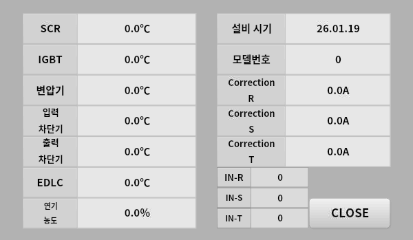

# Project Brief — SenvasSample

## 1. 프로젝트 개요

- **프로젝트명**: SenvasSample
- **앱 이름**: SenvasSample
- **목적**: 수냉식 100kVA TSP(무정전전원장치) 모니터링 HMI. RP2040 기반 센서 보드로부터 온도/전류/연기감지기 데이터를 Modbus RTU로 수신하여 실시간 모니터링하고, 경고 임계값 및 보정값을 설정하는 터치 패널 애플리케이션.
- **해상도**: 1024x600 (10인치 터치 패널)
- **테마**: Dark

---

## 2. 화면 구성

### 페이지 목록

#### MonitoringPage
- **역할**: 메인 모니터링 화면. 온도/전류/연기 센서 데이터 실시간 표시, 센서 입력 상태 램프, MCCB 출력 상태 램프, 이력 데이터그리드
- **레이아웃**: 
- **주요 컨트롤**:
  - **Temp Monitor 테이블** (좌측): 7개 항목(SCR, IGBT, 변압기, 입력차단기, 출력차단기, EDLC, 스모크농도)의 현재값 / 1st Warning / 2nd Warning 표시
  - **SENSOR INPUT 램프** (우상단): Cooling LEAK, DC FUSE, Cooling FAN1, Cooling FAN2 — 4개 GoLamp
  - **MCCB OUTPUT 램프** (우중단): INVERTER, INPUT, OUTPUT — 3개 GoLamp
  - **Monitor History DB** (우하단): GoDataGrid — Time, Status 컬럼
  - **Monitoring Settings 버튼** (하단): 클릭 시 CalibrationWindow 팝업
- **페이지 이동**: 없음 (단일 페이지)
- **열리는 윈도우**: Monitoring Settings 버튼 → CalibrationWindow

### 윈도우(팝업) 목록

#### CalibrationWindow
- **트리거**: MonitoringPage의 "Monitoring Settings" 버튼
- **역할**: 온도/연기 보정값 설정, 설비 정보 표시, 전류 보정값 설정
- **레이아웃**: 
- **주요 컨트롤**:
  - **좌측 보정 테이블**: 7개 항목의 보정값 표시/입력
    - SCR: 0.0°C (보정temp1)
    - IGBT: 0.0°C (보정temp2)
    - 변압기: 0.0°C (보정temp3)
    - 입력차단기: 0.0°C (보정temp4)
    - 출력차단기: 0.0°C (보정temp5)
    - EDLC: 0.0°C (보정temp6)
    - 연기농도: 0.0% (보정연기감지기1)
  - **우측 설비 정보**:
    - 설비 시기: YYMM.DD (설정값)
    - 모델번호: 숫자 (설정값)
    - Correction R: 0.0A (보정전류1)
    - Correction S: 0.0A (보정전류2)
    - Correction T: 0.0A (보정전류3)
    - IN-R: 현재 R_Current 표시
    - IN-S: 현재 S_Current 표시
    - IN-T: 현재 T_Current 표시 (참고: xlsx에서 T_Current는 D6=0x7006)
  - **CLOSE 버튼**: 윈도우 닫기
- **반환값**: 없음 (설정값은 직접 Modbus Write로 장비에 전송)

---

## 3. 통신

### Modbus RTU

- **포트명**: COM1 (Windows) / /dev/ttyUSB0 (Linux)
- **보드레이트**: 115200
- **패리티**: None
- **데이터비트**: 8
- **스톱비트**: 1
- **타임아웃(ms)**: 1000

**슬레이브 구성**

| 슬레이브 번호 | 역할 |
|-------------|------|
| 1 | RP2040 센서 보드 (수냉식 100kVA TSP) |

**레지스터 맵 — Data Read (FC3, Holding Register)**

| 주소 | 명칭 | 설명 | 단위 | R/W | FC |
|------|------|------|------|-----|-----|
| 0x7001 | BoardStatus | 보드 상태 (0=wait, 1=run) | - | R | FC3 |
| 0x7002 | AlarmStatus | 알람 상태 (비트맵) | - | R | FC3 |
| 0x7003 | InputStatus | 입력 상태 (0=none, 1=LEAK, 2=FUSE, 4=EMO, 8=FAN1, 16=FAN2) | - | R | FC3 |
| 0x7004 | OutputStatus | 출력 상태 (0=none, 1=INVERTER, 2=INPUT, 4=OUTPUT) | - | R | FC3 |
| 0x7005 | R_Current | R상 전류 (0.0A~750.0A, 750.0A=7500) | 0.1A | R | FC3 |
| 0x7006 | T_Current | T상 전류 | 0.1A | R | FC3 |
| 0x7007 | S_Current | S상 전류 | 0.1A | R | FC3 |
| 0x7008 | SCR_Temp | SCR 온도 (-20.0~90.0) | 0.1°C | R | FC3 |
| 0x7009 | IGBT_Temp | IGBT 온도 | 0.1°C | R | FC3 |
| 0x700A | Trans_Temp | 변압기 온도 | 0.1°C | R | FC3 |
| 0x700B | InBreaker_Temp | 입력차단기 온도 | 0.1°C | R | FC3 |
| 0x700C | OutBreaker_Temp | 출력차단기 온도 | 0.1°C | R | FC3 |
| 0x700D | EDLC_Temp | EDLC(슈퍼캡) 온도 | 0.1°C | R | FC3 |
| 0x700E | Temp7 | 예비 온도7 | 0.1°C | R | FC3 |
| 0x700F | Temp8 | 예비 온도8 | 0.1°C | R | FC3 |
| 0x7010 | Smoke1 | 연기감지기1 농도 | % | R | FC3 |
| 0x7011 | Smoke2 | 연기감지기2 농도 | % | R | FC3 |
| 0x7012 | Smoke3 | 연기감지기3 농도 | % | R | FC3 |

**레지스터 맵 — Data Write (FC6/FC16, Holding Register)**

| 주소 | 명칭 | 설명 | 단위 | R/W | FC |
|------|------|------|------|-----|-----|
| 0x7015 | SCR_TempSet1 | SCR 1차 Warning 온도 | 0.1°C | R/W | FC3/FC6 |
| 0x7016 | IGBT_TempSet1 | IGBT 1차 Warning 온도 | 0.1°C | R/W | FC3/FC6 |
| 0x7017 | Trans_TempSet1 | 변압기 1차 Warning 온도 | 0.1°C | R/W | FC3/FC6 |
| 0x7018 | InBreaker_TempSet1 | 입력차단기 1차 Warning 온도 | 0.1°C | R/W | FC3/FC6 |
| 0x7019 | OutBreaker_TempSet1 | 출력차단기 1차 Warning 온도 | 0.1°C | R/W | FC3/FC6 |
| 0x701A | EDLC_TempSet1 | EDLC 1차 Warning 온도 | 0.1°C | R/W | FC3/FC6 |
| 0x701B | Temp7Set1 | 예비온도7 1차 Warning | 0.1°C | R/W | FC3/FC6 |
| 0x701C | Temp8Set1 | 예비온도8 1차 Warning | 0.1°C | R/W | FC3/FC6 |
| 0x701D | Smoke1Set1 | 연기감지기1 1차 Warning | % | R/W | FC3/FC6 |
| 0x701E | Smoke2Set1 | 연기감지기2 1차 Warning | % | R/W | FC3/FC6 |
| 0x701F | Smoke3Set1 | 연기감지기3 1차 Warning | % | R/W | FC3/FC6 |
| 0x7021 | SCR_TempSet2 | SCR 2차 Warning 온도 | 0.1°C | R/W | FC3/FC6 |
| 0x7022 | IGBT_TempSet2 | IGBT 2차 Warning 온도 | 0.1°C | R/W | FC3/FC6 |
| 0x7023 | Trans_TempSet2 | 변압기 2차 Warning 온도 | 0.1°C | R/W | FC3/FC6 |
| 0x7024 | InBreaker_TempSet2 | 입력차단기 2차 Warning 온도 | 0.1°C | R/W | FC3/FC6 |
| 0x7025 | OutBreaker_TempSet2 | 출력차단기 2차 Warning 온도 | 0.1°C | R/W | FC3/FC6 |
| 0x7026 | EDLC_TempSet2 | EDLC 2차 Warning 온도 | 0.1°C | R/W | FC3/FC6 |
| 0x7027 | Temp7Set2 | 예비온도7 2차 Warning | 0.1°C | R/W | FC3/FC6 |
| 0x7028 | Temp8Set2 | 예비온도8 2차 Warning | 0.1°C | R/W | FC3/FC6 |
| 0x7029 | Smoke1Set2 | 연기감지기1 2차 Warning | % | R/W | FC3/FC6 |
| 0x702A | Smoke2Set2 | 연기감지기2 2차 Warning | % | R/W | FC3/FC6 |
| 0x702B | Smoke3Set2 | 연기감지기3 2차 Warning | % | R/W | FC3/FC6 |
| 0x702D | CorrectionCurrent1 | R상 보정전류 (-20.0A~20.0A) | 0.1A | R/W | FC3/FC6 |
| 0x702E | CorrectionCurrent2 | S상 보정전류 | 0.1A | R/W | FC3/FC6 |
| 0x702F | CorrectionCurrent3 | T상 보정전류 | 0.1A | R/W | FC3/FC6 |
| 0x7030 | CorrectionTemp1 | SCR 온도 보정값 (-20.0~20.0) | 0.1°C | R/W | FC3/FC6 |
| 0x7031 | CorrectionTemp2 | IGBT 온도 보정값 | 0.1°C | R/W | FC3/FC6 |
| 0x7032 | CorrectionTemp3 | 변압기 온도 보정값 | 0.1°C | R/W | FC3/FC6 |
| 0x7033 | CorrectionTemp4 | 입력차단기 온도 보정값 | 0.1°C | R/W | FC3/FC6 |
| 0x7034 | CorrectionTemp5 | 출력차단기 온도 보정값 | 0.1°C | R/W | FC3/FC6 |
| 0x7035 | CorrectionTemp6 | EDLC 온도 보정값 | 0.1°C | R/W | FC3/FC6 |
| 0x7036 | CorrectionTemp7 | 예비온도7 보정값 | 0.1°C | R/W | FC3/FC6 |
| 0x7037 | CorrectionTemp8 | 예비온도8 보정값 | 0.1°C | R/W | FC3/FC6 |
| 0x7038 | CorrectionSmoke1 | 연기감지기1 보정값 | % | R/W | FC3/FC6 |
| 0x7039 | CorrectionSmoke2 | 연기감지기2 보정값 | % | R/W | FC3/FC6 |
| 0x703A | CorrectionSmoke3 | 연기감지기3 보정값 | % | R/W | FC3/FC6 |
| 0x703B | DSP_Status | DSP 보드 상태 (0=정상, 1=Fault) | - | R/W | FC3/FC6 |
| 0x703C | BoardCommand | 보드 상태 변경 (0=wait, 1=run, 100=data_save) | - | R/W | FC3/FC6 |
| 0x703F | TouchBitSet | 터치 비트 설정 | - | R/W | FC3/FC6 |

**온도 데이터 인코딩**
- 부호 있는 16비트 값: bit15 = 부호 (1=음수, 0=양수), bit14~bit0 = 절대값
- 예: 50.5°C = 505 (0x01F9), -20.0°C = 0x80C8 (부호비트 + 200)
- 실제 온도 = (bit15 ? -1 : 1) * (bit14~bit0) / 10.0

**알람 코드 (AlarmStatus 비트맵, 0x7002)**

| 비트 | 코드 | 의미 |
|------|------|------|
| 0 | 0x0001 | Leak (냉각수 누수) |
| 1 | 0x0002 | IGBT ERR |
| 2 | 0x0004 | Over Current (과전류) |
| 3 | 0x0008 | Fuse Broken (퓨즈 단선) |
| 4 | 0x0010 | Super Cap Warning (슈퍼캡 경고) |
| 5 | 0x0020 | Super Cap Alarm (슈퍼캡 알람) |
| 6 | 0x0040 | Charge Empty |
| 7 | 0x0080 | Backup End ERR |
| 8 | 0x0100 | Line Over Voltage (과전압) |
| 9 | 0x0200 | Sensor Out (센서 이상) |
| 10 | 0x0400 | Fan Motion (팬 이상) |
| 11 | 0x0800 | Overload (과부하) |

**Warning 온도 기본값**

| 항목 | 1차 Warning | 2차 Warning |
|------|------------|------------|
| SCR | 75.0°C (750) | 85.0°C (850) |
| IGBT | 75.0°C (750) | 85.0°C (850) |
| 변압기 | 110.0°C (1100) | 120.0°C (1200) |
| 입력차단기 | 45.0°C (450) | 55.0°C (550) |
| 출력차단기 | 45.0°C (450) | 55.0°C (550) |
| EDLC(슈퍼캡) | 55.0°C (550) | 65.0°C (650) |
| 훈연감지기 | 50% | 60% |

---

## 4. 설정 파일 (DataManager)

저장/로드할 항목:

| 항목명 | 타입 | 기본값 | 설명 |
|--------|------|--------|------|
| PortName | string | "COM1" | 시리얼 포트명 |
| Baudrate | int | 115200 | 보드레이트 |
| SlaveId | int | 1 | Modbus 슬레이브 번호 |
| Timeout | int | 1000 | 통신 타임아웃 (ms) |
| InstallDate | string | "" | 설비 설치 시기 (YYMMDD) |
| ModelNumber | int | 0 | 모델 번호 |

---

## 5. 배포

- **타겟 플랫폼**: Going.UI.OpenTK (linux-arm64)
- **자동실행**: Y
- **키오스크 모드**: Y
